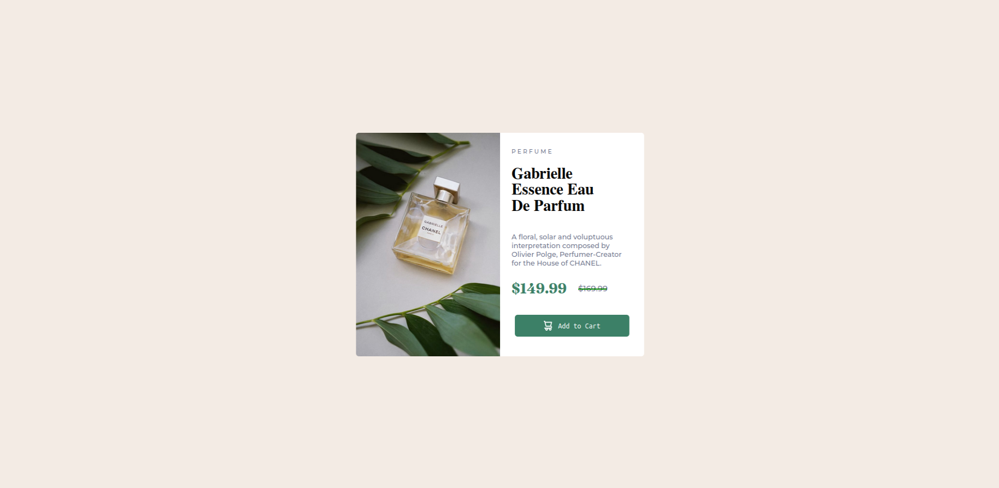
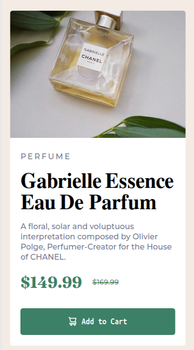

Página de Perfume

Este é um projeto simples de uma página de produto para um perfume. A página contém informações sobre o perfume, como nome, descrição e preço, além de um botão de ação com funcionalidade para o usuário. A principal funcionalidade desse projeto é que o botão muda de cor quando pressionado, tanto em desktops quanto em dispositivos móveis.

Este projeto foi desenvolvido para o Frontend Mentor, uma plataforma que oferece desafios para melhorar habilidades de desenvolvimento front-end.
Funcionalidades

    Layout Responsivo: A página se adapta para diferentes tamanhos de tela, com um design otimizado para dispositivos móveis.

    Interatividade: Quando o usuário clica no botão, a cor de fundo do botão muda, e a cor volta ao normal quando o clique é liberado. Esse comportamento foi implementado usando JavaScript.

Tecnologias Usadas

    HTML: Usado para estruturar o conteúdo da página.

    CSS: Usado para estilizar a página e tornar o layout agradável.

    JavaScript: Usado para adicionar interatividade, permitindo que a cor do botão mude ao ser clicado e volte ao normal quando o clique for solto, tanto em desktops quanto em dispositivos móveis.

Contribuições

Sinta-se à vontade para clonar este repositório e usá-lo como guia, caso você esteja no mesmo desafio. Tenho muito a melhorar, mas creio que pode servir de base para alguém. 😊

Imagens da Página

Imagem Desktop:

Imagem Mobile:

